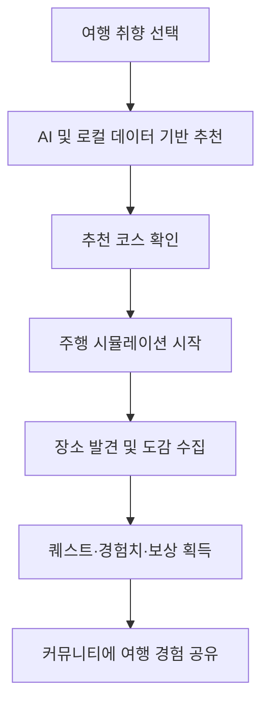

# 📍 Gumi LocalHub

> AI 추천과 게임형 여행 시뮬레이션으로 구미를 미리 경험하는 로컬 관광 서비스

## 🚀 배포 링크

### https://gumigumi.netlify.app/


---
## 👥 팀원


| 이름 | 역할 | GitHub |
| --- | --- | --- |
| 김대호 | 팀장 | [@hohoho0961]hohoho0961@gmail.com) |
| 김효 | 팀원 | [@KimHyo1](https://github.com/KimHyo1) |
| 유기연 | 팀원 | [@GiyeonYOOO]ygyp6095@naver.com |

## 프로젝트 소개

**Gumi LocalHub**는 구미·경북 지역의 관광 데이터를 활용해 사용자의 취향에 맞는 여행지를 추천하고, 여행 과정을 게임처럼 미리 체험할 수 있도록 만든 Vue 3 기반 SPA입니다.

관광지 목록만 보여주는 일반적인 여행 서비스에서 벗어나 AI 여행 추천, 주행 시뮬레이션, 퀘스트와 도감 수집 요소를 결합했습니다. 여행 전에는 코스를 탐색하고, 여행 중에는 날씨와 지역 정보를 확인하며, 여행 후에는 익명 커뮤니티에서 경험을 공유할 수 있습니다.

## 기획 배경

구미 지역에는 다양한 관광 자원이 있지만, 사용자의 여행 성향에 맞춰 장소를 추천하거나 여행 과정을 미리 경험하게 해주는 서비스는 부족합니다.

Gumi LocalHub는 다음 두 가지 문제를 해결하는 데 초점을 맞췄습니다.

- 흩어진 구미 관광 정보를 한곳에서 탐색하기 어렵다.
- 여행지를 선택하기 전 실제 이동과 방문 흐름을 상상하기 어렵다.

## 주요 기능

### 🤖 AI 맞춤 여행 추천

- 사용자의 질문과 여행 취향을 분석한 구미 여행지 추천
- 로컬 관광 데이터 검색 결과를 바탕으로 답변 생성
- 관광지, 맛집, 축제, 일정 등 질문 유형별 안내
- 화면 우측 하단 플로팅 챗봇으로 어디서든 이용 가능

### 🚗 게임형 여행 시뮬레이션

- 선택한 테마에 맞는 여행 코스 구성
- 목적지까지 이동하는 주행 장면과 진행 상태 제공
- 에너지, 행복도, 코인 등 게임 스탯 반영
- 장소 도착과 선택에 따라 여행 진행 상태 변경

### 🏠 여행자 성장 시스템

- 레벨, 경험치, 코인, 에너지 상태 관리
- 일일 퀘스트 진행 및 보상 획득
- 시간대에 따라 달라지는 홈 화면
- 에너지 자동 회복과 여행 행동 연계

### 📖 구미 관광지 도감

- 카테고리별 관광 장소 탐색
- 방문하거나 발견한 장소 수집
- 발견 여부, 수집률, 희귀도 표시
- 관광 데이터를 게임형 컬렉션으로 제공

### 💬 익명 지역 커뮤니티

- 자유, 맛집, 여행 후기, 지역 정보, 질문 카테고리 제공
- 게시글 작성·조회·수정·삭제 및 댓글·좋아요 지원
- 비밀번호 확인을 통한 익명 게시글 수정·삭제
- 검색과 최신순·인기순·조회순 정렬
- 브라우저 `localStorage` 기반 데이터 저장

### 🌤️ 여행 날씨 안내

- OpenWeatherMap 기반 현재 날씨 및 예보 조회
- 기온, 체감 온도, 습도, 강수 정보 제공
- 날씨 조건을 반영한 여행 적합도 계산

## 서비스 흐름



## 기술 스택

| 구분 | 기술 |
| --- | --- |
| Frontend | Vue 3, JavaScript, HTML5, CSS3 |
| Build | Vite |
| AI | OpenAI Chat Completions API |
| Weather | OpenWeatherMap API |
| Data | 구미·경북 관광 JSON 데이터 |
| Storage | Browser LocalStorage |
| Deployment | Netlify |

## 실행 방법

### 1. 저장소 복제

```bash
git clone https://github.com/KimHyo1/team7.git
cd team7/pjt
```

### 2. 패키지 설치

```bash
npm install
```

### 3. 환경 변수 설정

폴더에 `.env` 파일을 만들고 아래 값을 입력합니다.

```env
VITE_OPENAI_API_KEY=your_openai_api_key
VITE_OPENAI_MODEL=your_openai_model
VITE_WEATHER_API_KEY=your_openweathermap_api_key
```

`VITE_WEATHER_KEY`를 사용해도 날씨 API 키가 인식됩니다.

### 4. 개발 서버 실행

```bash
npm run dev
```

### 5. 프로덕션 빌드

```bash
npm run build
```

## 프로젝트 구조

```text
team7/
└── pjt/
    ├── public/              # 정적 파일 및 관광 데이터
    ├── src/
    │   ├── components/      # 지도, 시뮬레이션, 게시판, 날씨, 챗봇 UI
    │   ├── features/        # 홈·도감 등 기능 단위 화면
    │   ├── game/            # 플레이어 상태, 퀘스트, 장소 수집 로직
    │   ├── services/        # OpenAI·날씨 API 연동
    │   ├── utils/           # 로컬 검색 및 여행 점수 계산
    │   ├── App.vue          # 전체 화면 및 상태 연결
    │   └── main.js          # Vue 앱 진입점
    ├── package.json
    └── vite.config.js
```

## 데이터 저장 및 이용 안내

- 게시글과 게임 진행 상태는 브라우저의 `localStorage`에 저장됩니다.
- 브라우저나 기기가 달라지면 저장된 데이터가 공유되지 않습니다.
- 별도 백엔드와 회원가입 없이 익명으로 이용하는 구조입니다.
- 현재 API 요청은 프론트엔드에서 직접 전송하므로, 실제 공개 배포 시에는 API 키 보호를 위해 서버리스 함수 또는 별도 백엔드 프록시 사용을 권장합니다.

## 기대 효과

- 구미 관광 정보를 취향 중심으로 쉽고 빠르게 탐색
- 여행 전 코스와 이동 흐름을 시뮬레이션하여 선택 부담 감소
- 퀘스트와 수집 요소를 통한 지역 관광 콘텐츠의 몰입도 향상
- 커뮤니티를 통한 실제 방문 후기와 지역 정보 축적

---

<div align="center">
  <strong>구미 여행을 검색하는 것에서, 직접 플레이하는 경험으로.</strong>
</div>
